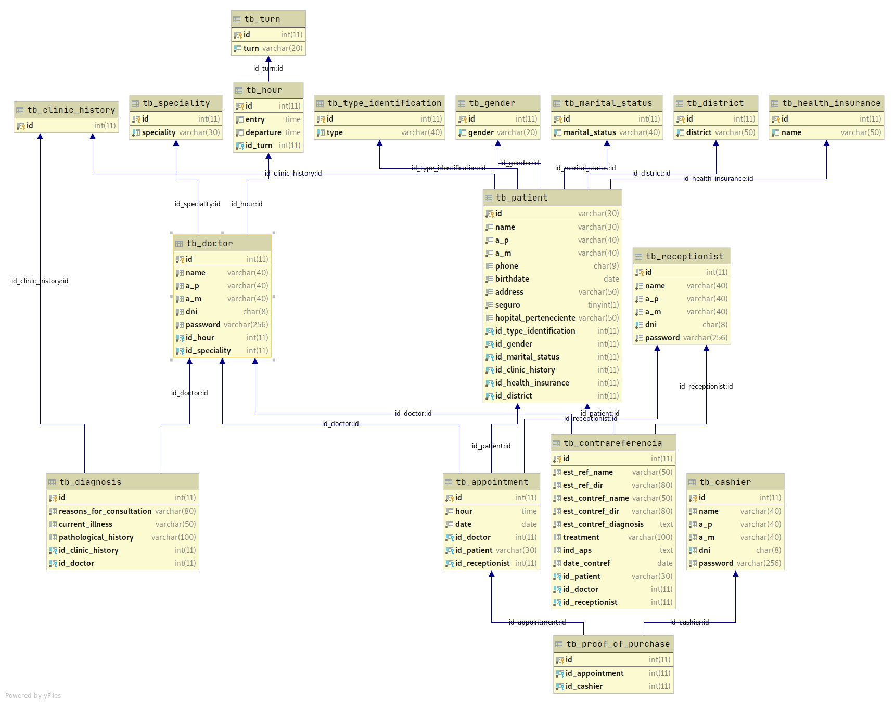

# Base de Datos Clinica

# Diagrama


# Script
```sql
DROP DATABASE IF EXISTS db_clinic;
CREATE DATABASE IF NOT EXISTS db_clinic;
USE db_clinic;

CREATE TABLE IF NOT EXISTS tb_cashier (
    id INT AUTO_INCREMENT PRIMARY KEY NOT NULL ,
    name VARCHAR ( 30 ) NOT NULL ,
    last_name VARCHAR ( 30 ) NOT NULL ,
    dni  CHAR ( 8 ) NOT NULL UNIQUE ,
    number_phone CHAR ( 9 ) NOT NULL UNIQUE ,
    password VARCHAR ( 250 ) NOT NULL
);

CREATE TABLE IF NOT EXISTS tb_clinic_history (
    id INT AUTO_INCREMENT PRIMARY KEY NOT NULL
);

CREATE TABLE IF NOT EXISTS tb_id_type (
    id INT AUTO_INCREMENT PRIMARY KEY NOT NULL ,
    type VARCHAR ( 50 ) NOT NULL UNIQUE
);

CREATE TABLE IF NOT EXISTS tb_patient (
    id INT AUTO_INCREMENT PRIMARY KEY NOT NULL ,
    name VARCHAR ( 30 ) NOT NULL ,
    last_name VARCHAR ( 30 ) NOT NULL ,
    number_phone CHAR ( 9 ) NOT NULL UNIQUE ,
    email VARCHAR ( 30 ) NOT NULL UNIQUE ,
    identification VARCHAR ( 50 ) NOT NULL UNIQUE ,
    id_type_id INT NOT NULL ,
    FOREIGN KEY ( id_type_id ) REFERENCES tb_id_type ( id )
);

CREATE TABLE IF NOT EXISTS tb_clinic_history_patient (
    number_hc INT PRIMARY KEY NOT NULL ,
    id_patient INT UNIQUE KEY NOT NULL ,
    FOREIGN KEY ( number_hc ) REFERENCES tb_clinic_history ( id ) ,
    FOREIGN KEY ( id_patient ) REFERENCES tb_patient ( id )
);

CREATE TABLE IF NOT EXISTS tb_receptionist (
    id INT AUTO_INCREMENT PRIMARY KEY NOT NULL ,
    name VARCHAR ( 30 ) NOT NULL ,
    last_name VARCHAR ( 30 ) NOT NULL ,
    dni  CHAR ( 8 ) NOT NULL UNIQUE ,
    number_phone CHAR ( 9 ) NOT NULL UNIQUE ,
    password VARCHAR ( 250 ) NOT NULL
);

# Doc
CREATE TABLE IF NOT EXISTS tb_turn (
    id INT AUTO_INCREMENT PRIMARY KEY NOT NULL ,
    turn VARCHAR ( 50 ) NOT NULL UNIQUE
);

CREATE TABLE IF NOT EXISTS tb_schedule (
    id INT AUTO_INCREMENT PRIMARY KEY NOT NULL ,
    entry_time TIME NOT NULL ,
    departure_time TIME NOT NULL ,
    id_turn INT NOT NULL ,
    FOREIGN KEY ( id_turn ) REFERENCES tb_turn ( id )
);

CREATE TABLE IF NOT EXISTS tb_specialty (
    id INT AUTO_INCREMENT PRIMARY KEY NOT NULL ,
    specialty VARCHAR ( 50 ) NOT NULL UNIQUE
);

CREATE TABLE IF NOT EXISTS tb_doctor (
    id INT AUTO_INCREMENT PRIMARY KEY NOT NULL ,
    name VARCHAR ( 30 ) NOT NULL ,
    last_name VARCHAR ( 30 ) NOT NULL ,
    dni  CHAR ( 8 ) NOT NULL UNIQUE ,
    number_phone CHAR ( 9 ) NOT NULL UNIQUE ,
    id_schedule INT NOT NULL ,
    id_specialty INT NOT NULL ,
    FOREIGN KEY ( id_schedule ) REFERENCES tb_schedule ( id ) ,
    FOREIGN KEY ( id_specialty ) REFERENCES tb_specialty ( id )
);

CREATE TABLE IF NOT EXISTS tb_diagnosis (
    id INT AUTO_INCREMENT PRIMARY KEY NOT NULL ,
    disease VARCHAR( 100 ) NOT NULL ,
    id_medico INT NOT NULL ,
    id_clinic_history INT NOT NULL ,
    FOREIGN KEY ( id_medico ) REFERENCES tb_doctor ( id ) ,
    FOREIGN KEY ( id_clinic_history ) REFERENCES tb_clinic_history ( id )
);

CREATE TABLE IF NOT EXISTS tb_appointment (
    id INT AUTO_INCREMENT PRIMARY KEY NOT NULL ,
    id_patient INT NOT NULL ,
    id_doctor INT NOT NULL ,
    id_receptionist INT NOT NULL ,
    FOREIGN KEY ( id_patient ) REFERENCES tb_patient ( id ) ,
    FOREIGN KEY ( id_doctor ) REFERENCES tb_doctor ( id ) ,
    FOREIGN KEY ( id_receptionist ) REFERENCES tb_receptionist ( id )
);

CREATE TABLE IF NOT EXISTS tb_proof_of_payment (
    id INT AUTO_INCREMENT PRIMARY KEY NOT NULL ,
    cancelled BOOL NOT NULL DEFAULT FALSE ,
    id_cashier INT NOT NULL ,
    id_appointment INT NOT NULL ,
    FOREIGN KEY ( id_cashier ) REFERENCES tb_cashier ( id ) ,
    FOREIGN KEY ( id_appointment ) REFERENCES tb_appointment ( id )
);

CREATE TABLE IF NOT EXISTS tb_contrareferencia (
    id INT AUTO_INCREMENT PRIMARY KEY NOT NULL ,
    name VARCHAR ( 30 ) NOT NULL ,
    last_name VARCHAR ( 30 ) NOT NULL ,
    number_phone CHAR ( 9 ) NOT NULL UNIQUE ,
    diagnosis VARCHAR ( 250 ) NOT NULL ,
    treatment VARCHAR ( 100 ) NOT NULL ,
    doctor VARCHAR ( 60 ) NOT NULL ,
    id_receptionist INT NOT NULL ,
    FOREIGN KEY ( id_receptionist ) REFERENCES tb_receptionist ( id )
);
```